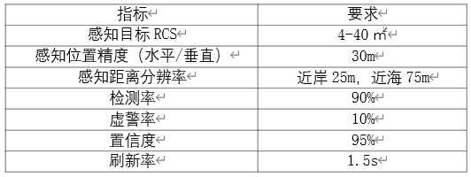
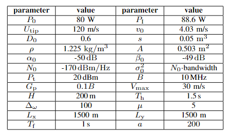

This is a sample blog post. Lorem ipsum I can't remember the rest of lorem ipsum and don't have an internet connection right now. Testing testing testing this blog post. Blog posts are cool.

Headings are cool
======

You can have many headings
======

Aren't headings cool?
------

#### 一、背景情况

##### 1. 行业报告

> 由智库、证券公司总结。

* 《2024全球无人机市场洞察报告》：无人机介绍，市场发展，区域发展，品牌概况

  无人机分类：

  * 按用途分类：军用无人机、消费级无人机（摄影、冒险、社交）、工业级无人机（建筑、房地产）
  * 按尺寸重量分类：小型、中型、大型
  * 按飞行能力分类：固定翼、单旋翼、单旋翼直升机

* 《低空经济：重点关注低空通信、空管、无人机、eVTOL四大领域》：空域空管介绍，低空经济产业链介绍

* 《中国无人机产业研究报告》：无人机产业链与产业情况统计。

* 《2024年中国军用无人机行业概览》：军用无人机应用现状，军用无人机产业链

* 《军用无人机产业百科》：百科

* ★《通信行业低空经济行业深度报告：“通感一体”将作为低空关键基建率先落地》：全面翔实

* 《通信行业：5G-A，通感融合赋能低空经济》：5G-A、通感的场景、公司

##### 2. 政府文件

> 【国家标准】由国家市场监督管理局&国家标准化管理委员会等国家部门制定，实时更新。
>
> 【现行法规】由民航局等专有管理部门颁定。

* 【国家标准】《民用轻小型无人机系统电磁兼容性要求与试验方法》：不同工作环境下的射频要求

* 【国家标准】《民用无人机系统型号命名》：无人机官方分类

* 【国家标准】《无人机低空遥感监测的多传感器一致性检测技术规范》：无人机感知测试方法、性能要求

* 【国家标准】《民用多旋翼无人机系统试验方法》：民用无人机各项功能指标的国家规定

* 【现行法规】《国家空域基础分类方法》：

  

  

  

##### 3. 技术协议

* 《3GPP Release18(TR 21.918)》：第一份也是唯一一份5G-A完成的5G-A技术报告。

  无人机通信是5G-A重要场景之一。

#### 二、业界需求

##### 1. 白皮书

* 中国移动《低空智联网技术体系白皮书》

  

  

* 中国移动《低空网络信息服务能力白皮书》：

  * 低空综合信息服务能力：全生命周期身份管理服务、信息链接服务、飞行基础服务、合作飞行信息服务、非合作飞行信息服务、算网融合服务、智能辅助决策服务
  * 低空网络增强能力：低空网络增强架构、可信身份识别机制、安全管理及定位追踪能力、网络AI辅助无人机监管、通感算一体化

* 中国移动《5G-A通感一体典型场景技术解决方案白皮书》

  * 通信指标：

    

  * 感知指标：

    * 成熟指标：RCS（雷达散射截面积），感知范围，位置精度，分辨率（径向、角度、速度），感知速度范围，置信度，刷新率

    * 细化指标：检测率（漏检率），虚警率

    * 创新指标（通感一体新场景）：轨迹完整度，感知信噪比，系统感知延时，空间覆盖率

  * 典型场景需求：

    * **低空经济**：无人机上行图片及视频回传、飞行态势监测、航路入侵检测、失控异常告警等。

    

    

    * **低空安防**：无人机视频巡检（上行图片及视频回传，兼顾下行控制链路数据传输）、电子围栏、轨迹跟踪等。

    

    

    * **航道管理**：对船只进行实时监测、精准识别、轨迹跟踪，以及获取船舶交通量、违章停靠等方面，同时兼顾通信覆盖需求。

    

    

    * **海面监测**：  船只巡检（上行图片及视频回传）、船只监测、航迹跟踪、海面电子围栏等方面，重点对网络覆盖距离提出更远的要求。

    

    

    * **地空一体**：  对低空进行无人机、飞鸟等空飘物监测，对地面车辆、人员识别探测等。

    

    

#### 三、场景建模

##### 1. 应用场景与参数

* X. Jing, F. Liu, C. Masouros and Y. Zeng, "ISAC From the Sky: UAV Trajectory Design for Joint Communication and Target Localization," in *IEEE Transactions on Wireless Communications*, vol. 23, no. 10, pp. 12857-12872, Oct. 2024.

  * 场景：

    

  * 参数：

    

  无人机高度H，Th最长感知时间，Vmax无人机最大速度，LxLy最大范围，B带宽

##### 2. 信道建模

* 于坤灿,向新,董鹏宇,等.复杂低空空地无线信道测量与分析[J].系统工程与电子技术,2024,46(12):4238-4247.

  > 本文在无线电频率划分规定下选择了3种场景(即水平距离分别为2.5km、 4.5km和5.4km)，并在2.4GHz频率下进行了实际信道测试活动，以获取信号幅度分布情况及多径个数与比例分布情况，基于信道数据研究分析了RMS-DS和莱斯K因子的累积分布函数拟合情况。同时，基于抽头延时线(tapped delayline, TDL)模型与实际测试数据构建出复杂低空空地无线信道模型，并提供仿真建模时调整信号参数的方法。 该项工作可为提升中小型无人机在复杂低空场景中的通信 性能奠定坚实基础。

* 于坤灿,向新,王鹏,等.低空无线信道小尺度衰落特性研究[J].空军工程大学学报,2023,24(05):95-101.

  > 本文根据我国无人机在840.5 ~845  MHz、1430~1  444  MHz和2  408~2  440  MHz频率下的使用规定，选择2.4  GHz在低空场景下进行信道测量，通过分析信道测量结果，深入探讨了低空无线信道小尺度衰落特性问题，并提出相应的特性分布函数。

* 刘浩.E波段低空空地信道建模研究[D].东南大学,2021.DOI:10.27014/d.cnki.gdnau.2021.000397.

  > 1.  概述了无线信道的基本特征及重要参数，分析了E波段在无线移动通信场景下的优势及面临的问题。
  > 2.  对E波段（71-76GHz，81-86GHz）在航空信道场景下的降雨衰减、大尺度衰落及小尺度衰落等进行了详细讨论。
  > 3.  提出基于机器学习算法的低空信道大尺度衰落预测模型。

* A. A. Khuwaja, Y. Chen, N. Zhao, M. -S. Alouini and P. Dobbins, "A Survey of Channel Modeling for UAV Communications," in *IEEE Communications Surveys & Tutorials*, vol. 20, no. 4, pp. 2804-2821, Fourthquarter 2018.

  

##### 3. 收发模式

* 中国移动《5G-A通感一体典型场景技术解决方案白皮书》

  

* A. Liu *et al*., "A Survey on Fundamental Limits of Integrated Sensing and Communication," in *IEEE Communications Surveys & Tutorials*, vol. 24, no. 2, pp. 994-1034, Secondquarter 2022.

  * 无设备（device-free）ISAC：感知目标没有射频设备。

    

  * 有设备（device-free）ISAC：感知目标有射频设备。

  

  

#### 四、技术研究
